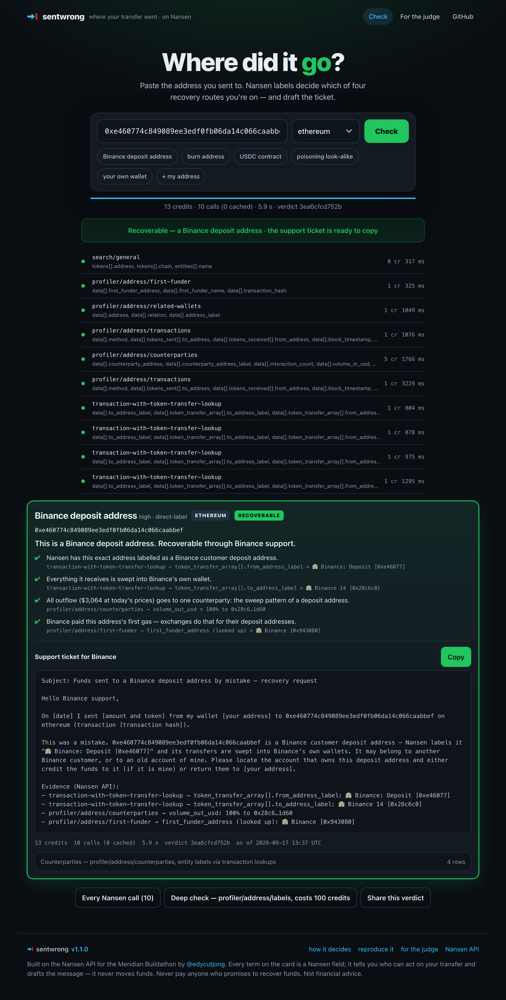

<div align="center">

# Sent Wrong

**Sent crypto to the wrong address? Paste it. Nansen tells you which of four recovery routes you're on — and drafts the ticket.**

[Live preview](https://sentwrong-3dc0do887-edy-cus-projects.vercel.app) · [30-second demo](DEMO.md) · [How it decides](docs/SCORING.md) · [Architecture](ARCHITECTURE.md) · [Nansen API friction log](docs/DX-REPORT.md)



</div>

## What it does

Someone sends USDC to an old deposit address from an email, a look-alike address planted in their history, or a contract. At 2 am they are Googling "can I get it back" and the first three results are recovery scams. The answer depends entirely on **what the recipient address is**, and only Nansen's entity labels know that for user-level addresses.

Sent Wrong takes the recipient address (and optionally yours), runs ten Nansen profiler and transaction lookups, and returns **one verdict card** with exactly one route, the Nansen evidence behind it (endpoint and field, on the card), and one copy button holding the message to send. No dashboard, no accounts, no token.

## The four routes

| Route | What Nansen showed | What you get |
|---|---|---|
| **Exchange deposit address** | the address itself is labelled `🏦 Binance: Deposit`, or everything it receives is swept into an exchange's own wallet | a prefilled support ticket for that exchange, with the evidence lines |
| **Your own wallet** | the recipient is in your address's related-wallets, or you were its first funder | a checklist — nothing is lost, here is how to reach it |
| **Active stranger** | an unlabelled wallet; states: *active* (moves funds), *dormant* (never sent), *fresh* (no history), *poisoner* (only ever "receives" homoglyph tokens — an address-poisoning address) | an on-chain memo with honest odds, or "report it, don't chase it" |
| **Contract or burn** | Nansen refuses it as a burn address (HTTP 422), it is a token contract, it has a deployer; *forwarder* when it sweeps into a named custodian | a note for your records and the warning that nobody can recover it — or "ask the service that issued this address" |

Anything Nansen could not answer is a **retry**, never a verdict. Failed lookups are listed on the card, not hidden.

Screenshots: [input](docs/screenshots/01-input.png) · [Binance deposit](docs/screenshots/02-binance-deposit.png) · [burn address](docs/screenshots/03-burn.png) · [poisoning look-alike](docs/screenshots/04-poisoner.png) · [your own wallet, mobile](docs/screenshots/05-own-wallet-mobile.png)

## Quickstart

One env var, `npm i`, one command.

```bash
git clone https://github.com/edycutjong/sentwrong && cd sentwrong
npm install
export NANSEN_API_KEY=nsn_…            # https://app.nansen.ai/api — free tier works (a verdict costs 0–13 credits)
npm run sentwrong -- 0xe460774c849089ee3edf0fb06da14c066caabbef
```

```
EXCHANGE-DEPOSIT (high · direct-label)
This is a Binance deposit address. Recoverable through Binance support.
  ✔ Nansen has this exact address labelled as a Binance customer deposit address.
    transaction-with-token-transfer-lookup → token_transfer_array[].from_address_label = 🏦 Binance: Deposit [0xe46077]
  ✔ Everything it receives is swept into Binance's own wallet.
    transaction-with-token-transfer-lookup → token_transfer_array[].to_address_label = 🏦 Binance 14 [0x28c6c0]
  ✔ All outflow ($2,953 at today's prices) goes to one counterparty: the sweep pattern of a deposit address.
    profiler/address/counterparties → volume_out_usd = 100% to 0x28c6…1d60
  ✔ Binance paid this address's first gas — exchanges do that for their deposit addresses.
    profiler/address/first-funder → first_funder_address (looked up) = 🏦 Binance [0x943080]

Support ticket for Binance
────────────────────────────────────────────────────────────
Subject: Funds sent to a Binance deposit address by mistake — recovery request
…
13 credits · 10 calls (0 cached) · 3.9s · verdict 3ea6cfcd752b
```

Options: `--from <your address>` (own-wallet check + finds your transfer for the ticket) · `--chain ethereum|base|arbitrum|polygon|optimism|bnb|avalanche|linea` · `--json` · `--explain` (rule fired, every call with fields and timing) · `--deep` (one `profiler/address/labels` call, **100 credits**, cost printed, shows whether it agrees) · `--no-cache`.

Web app: `npm run dev -w apps/web` → http://localhost:3000 (same engine; the key stays on the server; rows appear as each Nansen call lands).

## Runs in under 10 minutes

Timed with `date` around each step on a fresh clone into an empty directory (macOS, Node 22, warm npm cache, 2026-09-16 15:05 UTC):

| Step | Command | Measured |
|---|---|---|
| 1 | `git clone https://github.com/edycutjong/sentwrong && cd sentwrong && npm install` | 7 s |
| 2 | `export NANSEN_API_KEY=…` | typing |
| 3 | `npm run sentwrong -- 0xe460774c849089ee3edf0fb06da14c066caabbef --explain` (live, 13 credits) | 6 s (5.0 s of it Nansen) |
| 4 | `npm run verify` — 13 recorded verdicts replayed offline, 0 credits, 0 network | < 1 s |
| 5 | `npm test` — 111 vitest tests | 3 s |
| 6 | `npm run dev -w apps/web`, open http://localhost:3000, paste an address | ~20 s (first compile) |
| | **Total, including reading this README** | **well under 10 minutes; the commands themselves take about 40 s** (a cold npm cache adds a minute or two) |

## Nansen integration

Every decision term is a Nansen response field. Nothing else is consulted — no Etherscan, no RPC, no local address list.

| Endpoint | Credits | Fields used | What it decides |
|---|---|---|---|
| `search/general` | 0 | `tokens[].address/symbol/chain` | token contract at this address → contract route, before anything is paid for |
| `profiler/address/transactions` | 1 (+1 all-time for quiet addresses) | `data[].method`, `tokens_sent[].to_address`, `tokens_received[].from_address/token_symbol`, `block_timestamp`, `transaction_hash`, `pagination.is_last_page`; **HTTP 422 "Burn address"** | in/out counts, the sweep hashes to look up, last activity, the sender's transfer, homoglyph spoof tokens (poisoning), burn |
| `profiler/address/counterparties` | 5 | `counterparty_address`, `counterparty_address_label`, `interaction_count`, `volume_in_usd`, `volume_out_usd` | outflow concentration (100 % to one wallet = sweep), look-alike counterparties (poisoning), the evidence table |
| `profiler/address/related-wallets` | 1 (+1 on your address) | `relation`, `address`, `address_label` | `Deployed by`/`Created by` → contract; recipient ↔ sender link → your own wallet |
| `profiler/address/first-funder` | 1 | `first_funder_address`, `first_funder_name`, `transaction_hash`, `chain` | funder identity (exchange gas dripper vs you), the funding tx to look up |
| `transaction-with-token-transfer-lookup` | 1 × ≤4 | `token_transfer_array[].from_address_label`, `to_address_label`, `from_address`, `to_address` | **the entity labels** — `🏦 Binance: Deposit`, `🏦 Coinbase`, `🤖 BitGo MultiSig`, `🤖 🏦 Uniswap: V2 Router 2` — on the address and its counterparties |
| `profiler/address/labels` | 100, `--deep` only | `label`, `category`, `kind` | a second opinion; the card says whether it agrees |

A cold verdict costs 0–13 credits and makes 1–10 calls; a warm one (24 h cache) costs 0. The full decision table with the real numbers is in [docs/SCORING.md](docs/SCORING.md).

## Why only Nansen

- **User-level deposit addresses are labelled.** Etherscan tags "Binance 14"; Nansen's `transaction-with-token-transfer-lookup` labels the customer's deposit address itself — `🏦 Binance: Deposit [0xe46077]` — for 1 credit. That single field is the difference between "some address" and "file a ticket with Binance".
- **Relations, not just code.** `related-wallets.relation` says `Deployed by`, `Created by`, `First Funder`, `Multisig Signer of` — an RPC says "contract or not", never whose.
- **The gas dripper identifies the exchange** before a deposit address has ever swept: `first-funder` → funding tx → `🏦 Binance [0x943080]`.
- **Aggregates per counterparty.** `counterparties.volume_out_usd` gives the 100 %-to-one-wallet sweep signature in one row.
- **Even the refusal is a signal**: `422 Burn address not allowed`.

What we learned the hard way is in [docs/DX-REPORT.md](docs/DX-REPORT.md) — including that the cheap profiler label fields carry wealth tags only, and that the all-time date range makes Nansen time out on routers (hence the 14-day/all-time two-stage window).

## Tests, fixtures and replay

- **111 vitest tests** (`npm test`): the decision table rule by rule, with the regressions live QA produced (a wallet depositing into its own `Binance: Deposit` address; Nansen's 🏦 marker on Uniswap's router; an exchange wallet given as "your address"), label parsing on the exact strings Nansen returns, the action texts, the wire-level call plan, client retry/timeout, cache, and a replay of every fixture.
- **13 fixtures** (`fixtures/*.json`): real Nansen responses recorded live on 2026-09-16 by `npm run seed`, byte-for-byte, never edited, no key material. `npm run verify` replays them with `NANSEN_OFFLINE=1` → **13/13 verdicts reproduced offline**, same decision hash, zero network, zero credits. They exist so CI and a judge without a key can see the engine decide; the CLI and the web app hit Nansen live by default and say "cached" when they do not.
- CI (`.github/workflows/ci.yml`): typecheck, tests, offline verify, submission-readiness check — no key needed.

## Benchmark

`npm run bench` — 13 addresses × 3 runs, cold (fresh cache, every call live) then warm (same verdict from cache), decision hash compared. Numbers and reproduce steps in [DEMO.md](DEMO.md).

## Honesty notes

- The hero address, the poisoning look-alikes and the burn/contract examples are real addresses found on-chain the day this was built; deposit addresses were harvested from one USDT sweep block into Binance 14 and one into Coinbase 10.
- "Odds" on the stranger route are words, not numbers: Nansen tells us whether the wallet moves funds; nobody knows whether its owner is honest.
- A verdict is triage, not legal advice. Do not pay anyone who promises to recover funds — every route's text says so.

## License

MIT — see [LICENSE](LICENSE).
