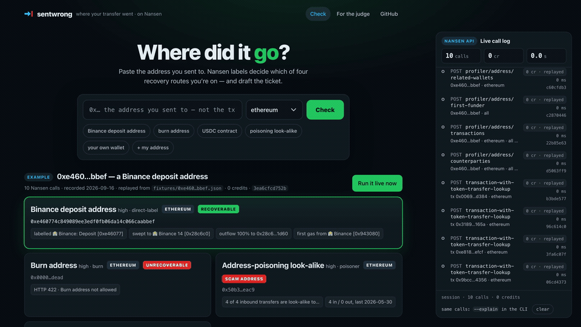
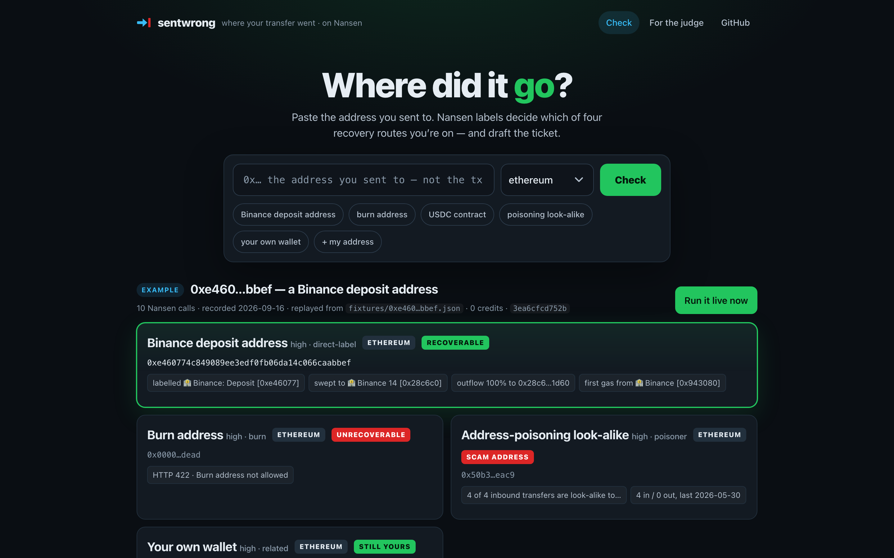
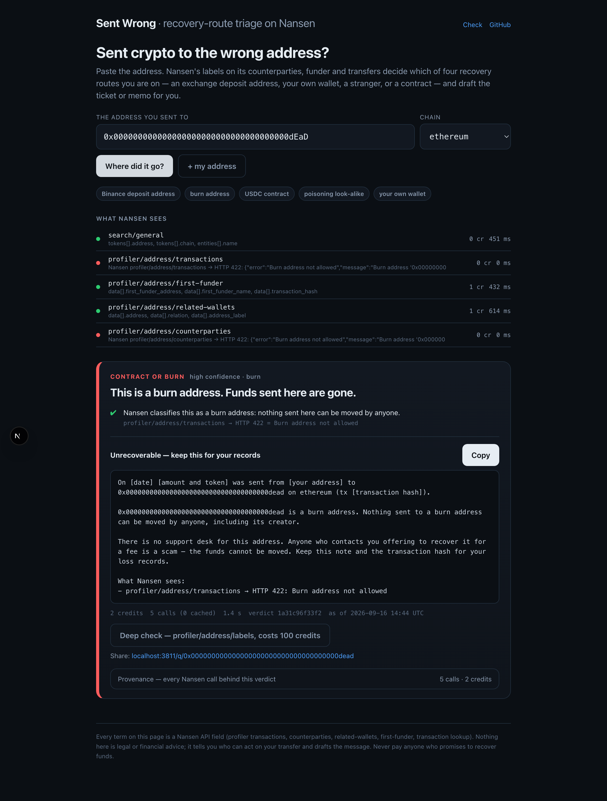
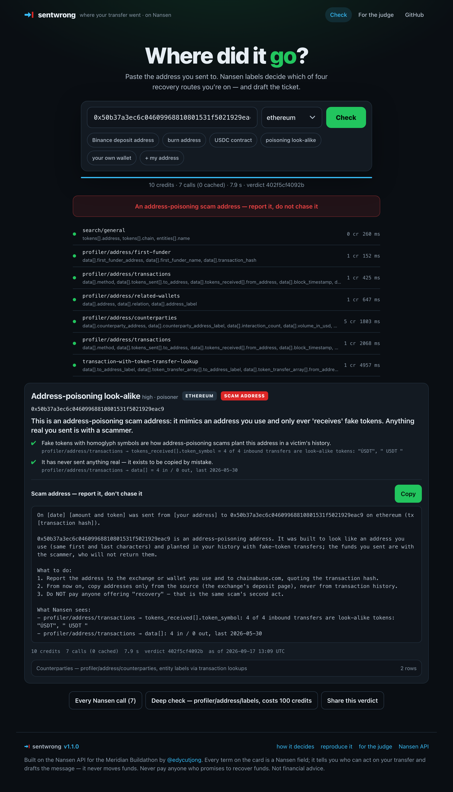
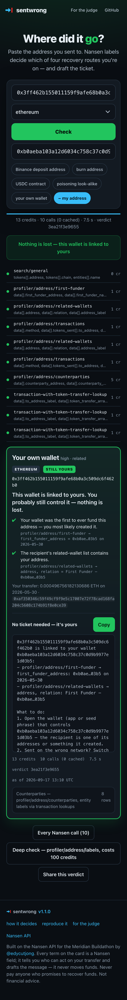
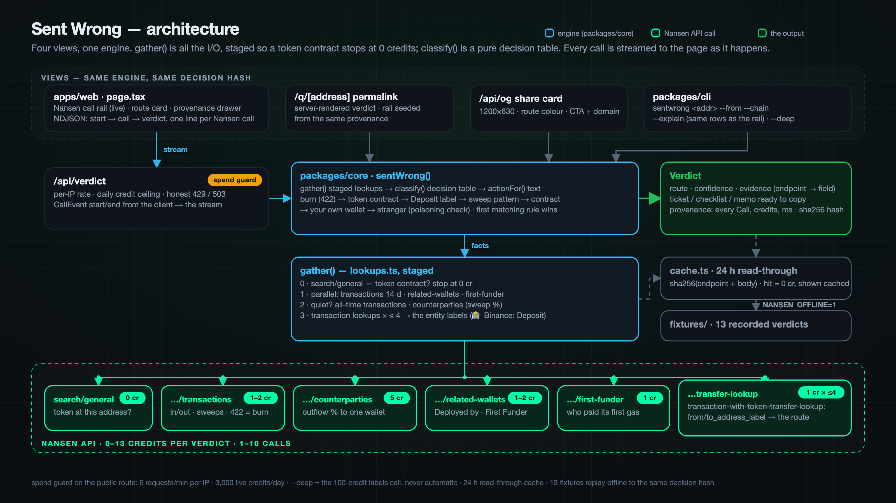
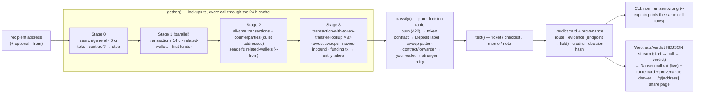

<div align="center">
  
  <h1>Sent Wrong 🧭</h1>
  <p><em>Sent crypto to the wrong address? Paste it. Nansen tells you which of four recovery routes you're on — and drafts the ticket.</em></p>
  

  <p>A cold verdict on the hero address costs <b>13 credits</b> across <b>10 Nansen calls</b> and returns in <b>3.9 s</b>; its decision hash <code>3ea6cfcd752b</code> reproduces from a second fresh clone and from the recorded fixture. <code>npm run verify</code> replays <b>13/13</b> verdicts offline — zero network, zero credits.</p>

  <br/>

  [](https://sentwrong.edycu.dev)
  [](https://sentwrong.edycu.dev/judge)
  [](https://nansen.ai/campaigns/meridian-buildathon)

  <br/>

  
  
  
  [](https://opensource.org/licenses/MIT)
  [](https://github.com/edycutjong/sentwrong/actions/workflows/ci.yml)
  [](https://github.com/edycutjong/sentwrong/releases/latest)

</div>

---

## 📸 See it in Action



| | |
|---|---|
|  |  |
| [input](docs/screenshots/01-input.png) | [burn address](docs/screenshots/03-burn.png) |
|  |  |
| [poisoning look-alike](docs/screenshots/04-poisoner.png) | [your own wallet, mobile](docs/screenshots/05-own-wallet-mobile.png) |

Screenshots: [input](docs/screenshots/01-input.png) · [Binance deposit](docs/screenshots/02-binance-deposit.png) · [burn address](docs/screenshots/03-burn.png) · [poisoning look-alike](docs/screenshots/04-poisoner.png) · [your own wallet, mobile](docs/screenshots/05-own-wallet-mobile.png)

## 💡 The Problem & Solution

### The Problem

Someone sends USDC to an old deposit address from an email, a look-alike address planted in their history, or a contract. At 2 am they are Googling "can I get it back" and the first three results are recovery scams. The answer depends entirely on **what the recipient address is**, and only Nansen's entity labels know that for user-level addresses.

### The Solution

Sent Wrong takes the recipient address (and optionally yours), runs ten Nansen profiler and transaction lookups, and returns **one verdict card** with exactly one route, the Nansen evidence behind it (endpoint and field, on the card), and one copy button holding the message to send. No dashboard, no accounts, no token.

### The four routes

| Route | What Nansen showed | What you get |
|---|---|---|
| **Exchange deposit address** | the address itself is labelled `🏦 Binance: Deposit`, or everything it receives is swept into an exchange's own wallet | a prefilled support ticket for that exchange, with the evidence lines |
| **Your own wallet** | the recipient is in your address's related-wallets, or you were its first funder | a checklist — nothing is lost, here is how to reach it |
| **Active stranger** | an unlabelled wallet; states: *active* (moves funds), *dormant* (never sent), *fresh* (no history), *poisoner* (only ever "receives" homoglyph tokens — an address-poisoning address) | an on-chain memo with honest odds, or "report it, don't chase it" |
| **Contract or burn** | Nansen refuses it as a burn address (HTTP 422), it is a token contract, it has a deployer; *forwarder* when it sweeps into a named custodian | a note for your records and the warning that nobody can recover it — or "ask the service that issued this address" |

Anything Nansen could not answer is a **retry**, never a verdict. Failed lookups are listed on the card, not hidden.

## 🏗️ Architecture & Tech Stack

One engine (`packages/core`), two faces (CLI and web). `gather()` is all the I/O — staged so a token contract ends the search at 0 credits and a quiet address gets its whole history; `classify()` is a pure decision table; `text()` writes the copy button. Every failure is a value, never an exception. Full module-by-module notes and the cold call trace are in [ARCHITECTURE.md](ARCHITECTURE.md); the decision table is [docs/SCORING.md](docs/SCORING.md).

<p align="center"></p>

<details>
<summary><b>Mermaid source</b> — expand to see the diagram as text (renders on GitHub)</summary>



</details>

| Layer | Choice | Where |
|---|---|---|
| Data | Nansen API — 7 endpoints, the only source consulted (no Etherscan, no RPC, no local address list) | `packages/core/src/nansen.ts`, `client.ts` |
| Engine | TypeScript: `lookups.ts` → `classify.ts` → `text.ts` → `verdict.ts`; sha256 decision hash | `packages/core` |
| Cache / replay | read-through cache keyed by sha256(endpoint + body), 24 h TTL, `NANSEN_OFFLINE=1` replay of recorded fixtures | `packages/core/src/cache.ts`, `fixtures/` |
| CLI | `tsx` — `sentwrong <address> [--from] [--chain] [--json] [--explain] [--deep] [--no-cache]` | `packages/cli` |
| Web | Next.js 15 — the Nansen call rail (every call live: pending → live/cached/error, credits, ms, hash), verdict card, copy button, provenance drawer, share page, route-coloured OG card; key stays server-side | `apps/web` |
| Tests / CI | vitest (212 tests: unit, 40,000-case property, key-boundary), Playwright (6 suites, no key), offline fixture replay, 7-stage GitHub Actions pipeline (gates → Vercel production deploy) + CodeQL + gitleaks + Dependabot | `.github/workflows/` |
| Hosting | Vercel — production domain tracks `main` | https://sentwrong.edycu.dev |

## 🏆 Nansen Integration

Every decision term is a Nansen response field. Nothing else is consulted — no Etherscan, no RPC, no local address list.

| Endpoint | Credits | Fields used | What it decides |
|---|---|---|---|
| `search/general` | 0 | `tokens[].address/symbol/chain` | token contract at this address → contract route, before anything is paid for |
| `profiler/address/transactions` | 1 (+1 all-time for quiet addresses) | `data[].method`, `tokens_sent[].to_address`, `tokens_received[].from_address/token_symbol`, `block_timestamp`, `transaction_hash`, `pagination.is_last_page`; **HTTP 422 "Burn address"** | in/out counts, the sweep hashes to look up, last activity, the sender's transfer, homoglyph spoof tokens (poisoning), burn |
| `profiler/address/counterparties` | 5 | `counterparty_address`, `counterparty_address_label`, `interaction_count`, `volume_in_usd`, `volume_out_usd` | outflow concentration (100 % to one wallet = sweep), look-alike counterparties (poisoning), the evidence table |
| `profiler/address/related-wallets` | 1 (+1 on your address) | `relation`, `address`, `address_label` | `Deployed by`/`Created by` → contract; recipient ↔ sender link → your own wallet |
| `profiler/address/first-funder` | 1 | `first_funder_address`, `first_funder_name`, `transaction_hash`, `chain` | funder identity (exchange gas dripper vs you), the funding tx to look up |
| `transaction-with-token-transfer-lookup` | 1 × ≤4 | `token_transfer_array[].from_address_label`, `to_address_label`, `from_address`, `to_address` | **the entity labels** — `🏦 Binance: Deposit`, `🏦 Coinbase`, `🤖 BitGo MultiSig`, `🤖 🏦 Uniswap: V2 Router 2` — on the address and its counterparties |
| `profiler/address/labels` | 100, `--deep` only | `label`, `category`, `kind` | a second opinion; the card says whether it agrees |

A cold verdict costs 0–13 credits and makes 1–10 calls; a warm one (24 h cache) costs 0. The full decision table with the real numbers is in [docs/SCORING.md](docs/SCORING.md).

**Watch the calls happen.** The web app's right-hand **Nansen call rail** streams every call as it is made — a pending row the moment the engine announces it, then the finished one with `POST endpoint`, the parameters, credits, latency and the response hash — with counters that tick; the rows are the very `Call` objects the provenance drawer and `--explain` print, so the rail, the drawer and the CLI always agree to the credit. On load it shows the recorded example's replayed calls, labelled `0 cr · replayed`.

### Why only Nansen

- **User-level deposit addresses are labelled.** Etherscan tags "Binance 14"; Nansen's `transaction-with-token-transfer-lookup` labels the customer's deposit address itself — `🏦 Binance: Deposit [0xe46077]` — for 1 credit. That single field is the difference between "some address" and "file a ticket with Binance".
- **Relations, not just code.** `related-wallets.relation` says `Deployed by`, `Created by`, `First Funder`, `Multisig Signer of` — an RPC says "contract or not", never whose.
- **The gas dripper identifies the exchange** before a deposit address has ever swept: `first-funder` → funding tx → `🏦 Binance [0x943080]`.
- **Aggregates per counterparty.** `counterparties.volume_out_usd` gives the 100 %-to-one-wallet sweep signature in one row.
- **Even the refusal is a signal**: `422 Burn address not allowed`.

What we learned the hard way is in [docs/DX-REPORT.md](docs/DX-REPORT.md) — including that the cheap profiler label fields carry wealth tags only, and that the all-time date range makes Nansen time out on routers (hence the 14-day/all-time two-stage window).

## 📊 Engineering Rigor

| Metric | Value |
|---|---|
| Tests | **212 vitest tests** (`npm test`), 9 s — **11 regression tests named after the defect they pin**, 8 key-boundary tests, 4 property-based tests |
| Spend guard | public route capped at **6 requests/min per address** (429) and **3,000 live credits/day** (honest 503 past it, before any Nansen call) — `deep` costs 100 credits per click, so the ceiling bounds it — `apps/web/lib/guard.ts`, `packages/core/test/guard.test.ts` |
| Property-based verification | **40,000 generated Nansen response sets** through `classify()` (fast-check, 4 properties × 10,000): exactly one of the five routes every time · a failed `transactions` lookup never yields a stranger verdict · the decision hash is invariant to USD prices · pure. All 14 route/sub-state pairs reached |
| E2E (Playwright) | **6 suites, 58 runs** (chromium + Pixel 7) against the built app with **no key**: home (the recorded example, "Run it live now"), the Nansen call rail (seeded rows, failed-run closure, bar/sheet on a phone), `/judge`, validation + honest no-key error, responsive 375/768/1440, key-never-reaches-the-client |
| Lighthouse (`npm run lighthouse`) | `/` and `/judge`: performance **100** · accessibility **100** · best practices 96 · SEO **100** (desktop, median of 3, 2026-09-17) |
| Fixtures | **13** real Nansen responses recorded live 2026-09-16, byte-for-byte; `npm run verify` → **13/13 verdicts reproduced offline**, same decision hash, 0 network, 0 credits |
| Benchmark, cold (13 addresses × 3 runs, every call live) | **p50 3157 ms · p95 6477 ms** · max 10567 ms |
| Benchmark, warm (same verdict from cache) | **p50 2 ms · p95 5 ms** · max 7 ms · 0 credits · identical decision hash on every run |
| Credits per verdict | mean **10.2** · min 0 · max 13 (39 verdicts, 309 live calls, 0 non-422 failures) |
| Hero verdict | 13 credits · 10 calls · 3.9 s · hash `3ea6cfcd752b` — stable across two `--no-cache` runs 45 s apart and a second fresh clone |
| Timed clean clone | commands take 40–60 s end to end (see [Runs in under 10 minutes](#runs-in-under-10-minutes)) |

### Benchmark

`npm run bench` — 13 addresses × 3 runs, cold (fresh cache, every call live) then warm (same verdict from cache), decision hash compared. Numbers and reproduce steps in [DEMO.md](DEMO.md).

### Honest limits (11)

1. The hero address, the poisoning look-alikes and the burn/contract examples are real addresses found on-chain the day this was built; deposit addresses were harvested from one USDT sweep block into Binance 14 and one into Coinbase 10.
2. "Odds" on the stranger route are words, not numbers: Nansen tells us whether the wallet moves funds; nobody knows whether its owner is honest.
3. A verdict is triage, not legal advice. Do not pay anyone who promises to recover funds — every route's text says so.
4. Nansen's per-call latency varies 0.3–3 s by the minute: the hero verdict measured 6 s on one fresh clone and 13 s on an independent re-run from a second (independent review 2026-09-16). The Uniswap V2 router — the busiest address in the bench set — can still hit the 10 s `transactions` cap and retry (10.6 s on one run; 3.6 s and 3.4 s on the others).
5. The 24 h on-disk cache is local only. On Vercel the cache is in-memory per function instance, so a cold start is fully live and a rehearsal does not reliably warm it — rehearse and record against `npm run dev -w apps/web` (independent review 2026-09-16).
6. **Bug found in review, fixed with a regression test:** the Uniswap V3 SwapRouter was read as a *forwarder* "that sweeps into Uniswap custody" because its outflow lands in labelled pools. A custodian must now carry a non-contract label; a DEX router is `contract-or-burn · contract` (independent review 2026-09-16, commit 33095ea).
7. **Bug found in review, fixed with a regression test:** a `transactions` timeout with the other lookups answering fell through to `active-stranger · fresh` — "Nothing on record" — a fabricated verdict on a slow Nansen minute. It is now a `retry` with `TRANSACTIONS_FAILED` (independent review 2026-09-16, commit 33095ea).
8. **Found in review:** Nansen returns `data: []` on every profiler endpoint for vitalik.eth, so the *fresh* headline no longer promises that waiting will help — Nansen may simply not index the address (independent review 2026-09-16; SCORING.md rule 7).
9. **Bug found in review, fixed:** the CLI cache TTL was 30 min in code while the docs said 24 h — now 24 h; and `/q/[address]` computed the verdict twice per view (`generateMetadata` + page), now deduped with React `cache()` (independent review 2026-09-16, commit 3390a30).
10. **Found in review, fixed:** the README linked a deployment-specific preview URL that would never receive fixes; it now links the production domain, which tracks `main` (independent review 2026-09-16, commit db45092).
11. `--deep` (`profiler/address/labels`) costs **100 credits** and is never automatic; its cost is printed before it runs and the card says whether it agrees.

## 🚀 Getting Started

### Prerequisites

- Node 20+ (`engines` in `package.json`; timed on Node 22)
- A Nansen API key from https://app.nansen.ai/api — free tier works (a verdict costs 0–13 credits)

### Installation

One env var, `npm i`, one command.

```bash
git clone https://github.com/edycutjong/sentwrong && cd sentwrong
npm install
export NANSEN_API_KEY=nsn_…            # https://app.nansen.ai/api — free tier works (a verdict costs 0–13 credits)
npm run sentwrong -- 0xe460774c849089ee3edf0fb06da14c066caabbef
```

```
EXCHANGE-DEPOSIT (high · direct-label)
This is a Binance deposit address. Recoverable through Binance support.
  ✔ Nansen has this exact address labelled as a Binance customer deposit address.
    transaction-with-token-transfer-lookup → token_transfer_array[].from_address_label = 🏦 Binance: Deposit [0xe46077]
  ✔ Everything it receives is swept into Binance's own wallet.
    transaction-with-token-transfer-lookup → token_transfer_array[].to_address_label = 🏦 Binance 14 [0x28c6c0]
  ✔ All outflow ($2,953 at today's prices) goes to one counterparty: the sweep pattern of a deposit address.
    profiler/address/counterparties → volume_out_usd = 100% to 0x28c6…1d60
  ✔ Binance paid this address's first gas — exchanges do that for their deposit addresses.
    profiler/address/first-funder → first_funder_address (looked up) = 🏦 Binance [0x943080]

Support ticket for Binance
────────────────────────────────────────────────────────────
Subject: Funds sent to a Binance deposit address by mistake — recovery request
…
13 credits · 10 calls (0 cached) · 3.9s · verdict 3ea6cfcd752b
```

Options: `--from <your address>` (own-wallet check + finds your transfer for the ticket) · `--chain ethereum|base|arbitrum|polygon|optimism|bnb|avalanche|linea` · `--json` · `--explain` (rule fired, every call with fields and timing) · `--deep` (one `profiler/address/labels` call, **100 credits**, cost printed, shows whether it agrees) · `--no-cache`.

Web app: `npm run dev -w apps/web` → http://localhost:3000 (same engine; the key stays on the server; rows appear as each Nansen call lands; locally it shares the CLI's on-disk 24 h cache layout under `apps/web/.cache`, so a rehearsed address stays warm across restarts).

### Runs in under 10 minutes

Timed with `date` around each step on a fresh clone into an empty directory (macOS, Node 22, warm npm cache, 2026-09-16 15:05 UTC):

| Step | Command | Measured |
|---|---|---|
| 1 | `git clone https://github.com/edycutjong/sentwrong && cd sentwrong && npm install` | 7 s |
| 2 | `export NANSEN_API_KEY=…` | typing |
| 3 | `npm run sentwrong -- 0xe460774c849089ee3edf0fb06da14c066caabbef --explain` (live, 13 credits) | 6 s (5.0 s of it Nansen); an independent re-run from a second fresh clone at 23:55 UTC took 13 s — Nansen's per-call latency varies 0.3–3 s by the minute |
| 4 | `npm run verify` — 13 recorded verdicts replayed offline, 0 credits, 0 network | < 1 s |
| 5 | `npm test` — 212 vitest tests | 9 s |
| 6 | `npm run dev -w apps/web`, open http://localhost:3000, paste an address | ~20 s (first compile) |
| | **Total, including reading this README** | **well under 10 minutes; the commands themselves take 40–60 s** (a cold npm cache adds a minute or two) |

## 🧪 Testing & CI

**7-stage pipeline** (`.github/workflows/ci.yml`): Quality → Security → Build → E2E → Performance → Deploy Gate → Production Deploy (prebuilt `vercel deploy` to sentwrong.edycu.dev, `main` only, after every gate; Vercel's git auto-deploy is off), with concurrency control and a Node 20/22/24 matrix on `main`.

```bash
# ── Code quality ────────────────────────────
npm run lint              # ESLint (flat config, TS + React hooks)
npm run format:check      # Prettier
npm run typecheck         # tsc --noEmit (engine, CLI, scripts, e2e) — CI also runs it for apps/web
npm test                  # 212 vitest tests, 9 s
npm run test:coverage     # + v8 coverage (engine 90 %+)
npm run verify            # replay the 13 fixtures with NANSEN_OFFLINE=1 — 13/13 verdicts, same hash, no key, no network
npm run check:submission  # no unfilled text, section names, test / fixture / property-case counts vs reality, links
npm run ci                # all of the above

# ── Advanced testing ────────────────────────
npm run e2e               # Playwright, 6 suites — builds and starts the web app WITHOUT a key
npm run e2e:ui            # Playwright interactive mode
npm run lighthouse        # Lighthouse CI on / and /judge (a11y ≥ 0.9 is a hard gate)
npm run bench             # 13 addresses × 3 runs live, cold/warm p50/p95 — costs credits

# ── Security ────────────────────────────────
npm run audit             # npm audit --audit-level=high
```

| Layer | Tool | Status |
|---|---|---|
| Code quality | ESLint + Prettier + TypeScript strict (engine, web app, e2e) | ✅ |
| Unit testing | vitest — 212 tests, v8 coverage | ✅ |
| High-signal tests | 11 defect-named regressions · 40,000-case property verification of `classify()` · key-boundary tests | ✅ |
| E2E testing | Playwright — 6 suites × 2 browsers, no key | ✅ |
| Security (SAST) | CodeQL (`javascript-typescript`) | ✅ |
| Security (SCA) | Dependabot (4 npm manifests + actions, grouped monthly, no majors) + `npm audit` + license-checker | ✅ |
| Secret scanning | gitleaks over the full history + TruffleHog (verified only) in CI | ✅ |
| Performance | Lighthouse CI (`/`, `/judge`), bundle budget | ✅ |
| Releases | `release.yml` — semantic version from conventional commits, from v1.0.0 | ✅ |
| Community | Code of conduct, contributing, security policy, issue + PR templates | ✅ |

- **212 vitest tests** (`npm test`): the decision table rule by rule, with the regressions live QA produced (a wallet depositing into its own `Binance: Deposit` address; Nansen's 🏦 marker on Uniswap's router; an exchange wallet given as "your address"; a DEX router read as a "forwarder"; a transactions timeout read as "nothing on record"), label parsing on the exact strings Nansen returns, the action texts, the wire-level call plan, client retry/timeout, cache, and a replay of every fixture.
- **13 fixtures** (`fixtures/*.json`): real Nansen responses recorded live on 2026-09-16 by `npm run seed`, byte-for-byte, never edited, no key material. `npm run verify` replays them with `NANSEN_OFFLINE=1` → **13/13 verdicts reproduced offline**, same decision hash, zero network, zero credits. They exist so CI and a judge without a key can see the engine decide; the CLI and the web app hit Nansen live by default and say "cached" when they do not.
- **40,000-case property verification** (`packages/core/test/classify.property.test.ts`): fast-check generates whole Nansen response sets — real label strings, 422 refusals, timeouts, spoof tokens, deployer relations, senders — and `classify()` must give exactly one enumerated route with at least one evidence line every time, never turn a failed `transactions` lookup into a stranger verdict, keep the decision hash invariant to USD prices, and stay pure.
- **Key-boundary tests** (`packages/core/test/boundary.test.ts`, `e2e/key-boundary.spec.ts`): the server key never appears in the verdict JSON, the streamed provenance, an error, the fixtures, the page HTML, the JS bundles or the OG route; malformed input is rejected before any network call. This is the concrete claim in [SECURITY.md](.github/SECURITY.md).
- **E2E** (`e2e/`, Playwright): the built app runs **without** a key — the home page, `/judge` (200, no cookies, claim present), the validation path (400 before any lookup), the honest "no key" banner instead of a fabricated verdict, and 375/768/1440 px layouts.
- CI (`.github/workflows/`): the 7-stage pipeline above, CodeQL, gitleaks (full history), Dependabot, and `release.yml` — no Nansen key needed anywhere; the one secret is `VERCEL_TOKEN` for the deploy stage.

## 📁 Project Structure

```
packages/core/src   the engine: client.ts (NansenClient) · cache.ts · nansen.ts (typed endpoints) · labels.ts
                    · lookups.ts (gather) · classify.ts (decision table) · text.ts · verdict.ts · fixtures.ts
packages/cli        sentwrong <address> [--from] [--chain] [--json] [--explain] [--deep] [--no-cache]
apps/web            Next.js 15: / · /api/verdict (NDJSON stream) · /q/[address] (share page) · /api/og
e2e/                Playwright suites (run against the built app with no key) · playwright.config.ts · lighthouserc.json
scripts             spike.ts · seed.ts · verify.ts · bench.ts · check_submission_readiness.ts
fixtures/           13 recorded live runs (real Nansen responses, byte-for-byte, no key material)
docs/               SCORING.md (the decision table) · DX-REPORT.md (Nansen API friction log) · screenshots/
.github/            ci.yml (7 stages) · codeql.yml · gitleaks.yml · release.yml · dependabot.yml · community files
ARCHITECTURE.md · DEMO.md · JUDGE.md (mirror of /judge) · LICENSE
```

## 📽️ Demo Materials

- **For the judge:** https://sentwrong.edycu.dev/judge — the claim, the 30-second click path with live links, the real-run receipts, the reproduce command, three honest limitations. Mirrored in [JUDGE.md](JUDGE.md).
- **Live app:** https://sentwrong.edycu.dev — same engine as the CLI, key server-side, rows stream as each Nansen call lands.
- **[30-second demo](DEMO.md):** the shot list, the hero query's verbatim `--explain --no-cache` output, and the full benchmark table with reproduce steps.
- **[How it decides](docs/SCORING.md)** · **[Architecture](ARCHITECTURE.md)** · **[Nansen API friction log](docs/DX-REPORT.md)**

## 📄 License

MIT — see [LICENSE](LICENSE).
